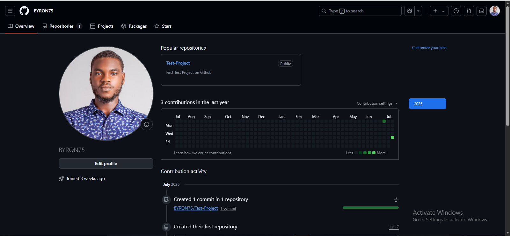

### HOW TO CREATE AN ACCOUNT ON GITHUB

## Step 1
- Search for github
- sign in

## STEP 2
- Navigate to the section that sayss "Create repository"

## TESTIIIINNGGGG
- Test again

## TEST 2
- This again
